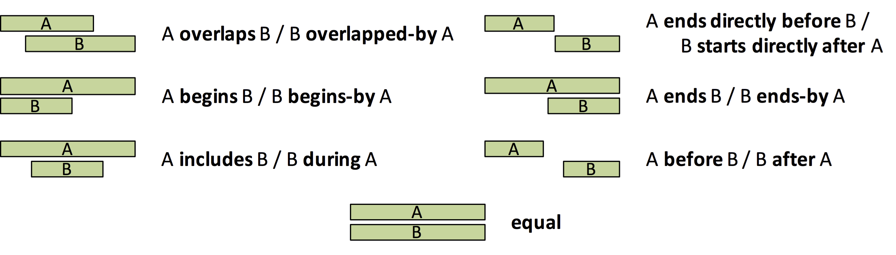

# What is an `Interval`

An interval defines a sub-set containing all the values lying between two values `s` and `e`
of a domain. Formally, an interval `[s, e]` of the domain X is defined as `{ x ∈ X | s ≤ x ∧ x ≤ e }`.
An interval can be open (on both or only one end), i.e.:
- `(s, e] := { x ∈ X | s < x ∧ x ≤ e }`.
- `[s, e) := { x ∈ X | s ≤ x ∧ x < e }`.
- `(s, e) := { x ∈ X | s < x ∧ x < e }`.
 
## Usage Examples

Within this library an interval is implemented by the `Interval` class, which internally implements the `IInterval` 
interface. The latter is used by the [`IntervalTree`](../README.md) implementation, also available within this library.

The provided implementation of the `IInterval` is able to handle all types of primitive numbers (using the
object-oriented representative, i.e., `Byte`, `Short`, `Integer`, `Long`, `Float`, `Double`).

```java
final Interval<Integer> sample1 = new Interval<>(5, 10);    // interval: [5, 10]
final Interval<Long> sample2 = new Interval<>(-123L, 123L); // interval: [-123, 123]
final Interval<Double> sample3 = new Interval<>(1.1, 2.2);  // interval: [1.1, 2.2]

// you can also specify the type of values stored
final Interval<Integer> i = new Interval<>(1, 5);  // interval: [1, 5]

// there are no simplified constructors defined, if you want to use open intervals
final Interval<Integer> openStart = new Interval<>(Integer.class, 1, 5, true, false);  // interval: (1, 5]
final Interval<Integer> openEnd = new Interval<>(Integer.class, 1, 5, false, true);    // interval: [1, 5)
final Interval<Integer> bothOpen = new Interval<>(Integer.class, 1, 5, true, true);    // interval: (1, 5)

// it is not allowed to specify 'invalid' intervals, i.e., end > start
final Interval<Integer> invalid1 = new Interval<>(5, 4);                               // invalid: [5, 4]
final Interval<Integer> invalid2 = new Interval<>(Integer.class, 5, 5, true, false);   // invalid: (5, 5]
```

## Operations

The implementation provides the following operations:
- `int compareTo(final IInterval interval)` (since. 1.5.0)
- `boolean equals(final Object obj)` (since 1.5.0)
- `boolean contains(Object value)` (since 1.5.1)
- `boolean overlaps(IInterval interval)` (since 1.5.2)
- `boolean irOverlaps(final IInterval interval)`, see [2](https://en.wikipedia.org/wiki/Allen's_interval_algebra) (since 1.5.2)
- `boolean irIsOverlappedBy(final IInterval interval)`, see [2](https://en.wikipedia.org/wiki/Allen's_interval_algebra) (since 1.5.2)
- `boolean irStarts(final IInterval interval)`, see [2](https://en.wikipedia.org/wiki/Allen's_interval_algebra) (since 1.5.2)
- `boolean irStartsBy(final IInterval interval)`, see [2](https://en.wikipedia.org/wiki/Allen's_interval_algebra) (since 1.5.2)
- `boolean irEnds(final IInterval interval)`, see [2](https://en.wikipedia.org/wiki/Allen's_interval_algebra) (since 1.5.2)
- `boolean irEndsBy(final IInterval interval)`, see [2](https://en.wikipedia.org/wiki/Allen's_interval_algebra) (since 1.5.2)
- `boolean irBefore(final IInterval interval)`, see [2](https://en.wikipedia.org/wiki/Allen's_interval_algebra) (since 1.5.2)
- `boolean irAfter(final IInterval interval)`, see [2](https://en.wikipedia.org/wiki/Allen's_interval_algebra) (since 1.5.2)
- `boolean irIncludes(final IInterval interval)`, see [2](https://en.wikipedia.org/wiki/Allen's_interval_algebra) (since 1.5.2)
- `boolean irIsDuring(final IInterval interval)`, see [2](https://en.wikipedia.org/wiki/Allen's_interval_algebra) (since 1.5.2)
- `boolean irEquals(final IInterval interval)`, see [2](https://en.wikipedia.org/wiki/Allen's_interval_algebra) (since 1.5.2)
- `boolean irStartsDirectlyBefore(final IInterval interval)`, see [2](https://en.wikipedia.org/wiki/Allen's_interval_algebra) (since 1.5.2)
- `boolean irEndsDirectlyBefore(final IInterval interval)`, see [2](https://en.wikipedia.org/wiki/Allen's_interval_algebra) (since 1.5.2)
- `AllenIntervalRelation ir(final IInterval interval)`, see [2](https://en.wikipedia.org/wiki/Allen's_interval_algebra) (since 1.5.2)

The `contains` method, checks if the interval contains the specified `value`, i.e., it returns true, if and only if 
`value ≤ x ∧ value ≤ e` assuming a closed interval `[s, e]`. The `value` can be of any valid type within the domain, 
(the `Interval` implementation assumes all (primitive) `Number` to be in the same domain), e.g.:

```java
new Interval<>(1L, 10L).contains(5) == true;

new Interval<>(1L, 10L).contains(1.0) == true;
new Interval<>(1L, 10L).contains(10.1) == false;
new Interval<>(1L, 10L).contains(10.0) == true

new Interval<>(Long.class, 1L, 2L, false, true).contains(2) == false;
```

The `compareTo` method validates, if an interval is smaller 
(`< 0`), equal (`== 0`), or larger (`> 0`) than another interval. The method allows to use a different types interval to
compare with, e.g., 

```java
new Interval<>(1L, 5L).compareTo(new Interval<>(1L, 5L))   == 0;  // i.e., equal
new Interval<>(1L, 5L).compareTo(new Interval<>(1.0, 5.0)) == 0;  // i.e., equal
new Interval<>(1L, 5L).compareTo(new Interval<>(0.9, 1.0))  > 0;  // i.e., [1, 5] > [0.9, 1.0]
new Interval<>(1L, 5L).compareTo(new Interval<>(1, 6))      < 0;  // i.e., [1, 5] < [1, 6]

// the specified type, specifies the boundaries
new Interval<>(Double.class, 1.0, 5.0, true, true).compareTo(new Interval<>(Long.class, 1L, 5L, true, true)) > 0;  // i.e., (1.0, 5.0) < (1, 5)
```

The methods `overlaps` checks if the interval overlaps with the specified `inteval`. The method returns `true`, if and only 
if the two intervals share at least one common element, i.e., `[s1, e1]` overlaps with `[s2, e2]`, if and only if 
`{ x ∈ X | s1 ≤ x ∧ x ≤ e1 } ∩ { x ∈ X | s2 ≤ x ∧ x ≤ e2 } ≠ ∅`.

```java
new Interval<>(1L, 5L).overlaps(new Interval<>(-1L, 10L)) == true;

new Interval<>(Double.class, 1.0, 4.9, true, true).overlaps(new Interval<>(Double.class, 4.9, 5.0, true, true)) == false;
new Interval<>(Double.class, 1.0, 4.9, true, false).overlaps(new Interval<>(Double.class, 4.9, 5.0, false, true)) == true;
```

Methods with the prefix `ir` (e.g., `irOverlap`, `irEquals`) are an implementation of 
[Allen's Interval Algebra](https://en.wikipedia.org/wiki/Allen's_interval_algebra), which are defined as following:

<p align="center">
  
</p>

It is important to notice, that one relation excludes all other, i.e., two intervals can only be in one of the specified relations.

## Extending Intervals... and what to consider

The provided `Interval` implementation implements the `IInterval` interface, which is needed for all other interval-based
structures in this library (e.g., `IntervalTree`). Nevertheless, when working with interval data, it is often needed to have 
more than just the interval itself, i.e., an identifier or more complex additional data may be associated with an interval. 
This additional data may also affect the similarity of intervals, i.e., let's assume we have the following data (using JSON):

```
[
    { start: 5, end: 10, id: 2 }, 
    { start: 5, end: 10, id: 3 }, 
    { start: 5, end: 10, id: 2 }
]
```

The JSON shows three intervals, from which two are equal (`{ start: 5, end: 10, id: 2 }`). The third interval 
(`{ start: 5, end: 10, id: 3 }`) is unequal to the others (based on the associated data). The default implementation
`Interval` would not recognize the difference and assume all of the three intervals are equal. To modify the handling,
it is recommended to `extend` the `Interval` implementation (and just add the new comparision).

```java
public class IdInterval<I extends Comparable<I>, T extends Number & Comparable<T>> extends Interval<T> {
    private final I id;

    /*
     * We removed the code for constructors and getters/setters, we also
     * did not add the compareId method, which just compares the actual 
     * identifiers (using the compareTo method of these).
     */

    @Override
    public int compareTo(final IInterval i) {
        final int cmp = super.compareTo(i);
        
        if (cmp == 0) {
            
            // the intervals are equal, so we must use the identifiers
            if (i instanceof IdInterval) {
                return compareId(IdInterval.class.cast(i));
            } 
            // we don't have any identifiers (the instance is of a different type)
            else {
                return getClass().getName().compareTo(i.getClass().getName());
            }
        } else {
            return cmp;
        }
    }
}
```

In this implementation, the most important line is `super.compareTo(i)`. You should always use the `super` implementation,
and only be more specific regarding the comparision, if the `super.compareTo` result is `0`. Otherwise, the intervals are 
already different and thus, the instances can never be equal. It should be mentioned, that the comparision defined by `compareTo`
is not used by, e.g., the `IntervalTree`. These implementation are utilizing the `Comparator<Object> getComparator()`
method, which is (if not overridden) utilizing the `int compareIntervals(final Object o1, final Object o2)` method.

## Remarks

### Working with Mixed Types of Intervals

When working with mixed types of intervals, e.g., double-based (like `new Interval<>(0.1, 0.5)`) and 
long-based intervals (like `new Intervals<>(5L, 6L)`), the `null` is interpreted within the specific domain of the type, e.g.,
a double cannot exceed a value as defined by `Double.MAX_VALUE`, whereby a long cannot be larger than `Long.MAX_VALUE`. Thus,
comparing mixed values using relations like `irEnds` or `irStarts` may lead to unexpected behavior, e.g., the following 
example is assumed to be `false`:

```java
new Interval<>(Double.class.cast(null), null).irEnds(new Interval<>(8L, null)) == false; // because Double.MAX_VALUE < LONG.MAX_VALUE
new Interval<>(Long.class.cast(null), null).irEnds(new Interval<>(8L, null)) == true;    // because both can reach the same maximum

new Interval<>(Double.class.cast(null), null).irEquals(new Interval<>(Long.class.cast(null), null)) == false, // because the possible end is different
```